# Application Mobile – Plateforme de Recharge Électrique (MyJouleBox)

## Contexte

Ce projet a été réalisé dans le cadre d’un **stage de 6 mois chez [MyJouleBox](https://www.myjoulebox.fr/)**, une entreprise qui œuvre pour l’accès à l’énergie solaire en Afrique de l’Ouest.  
L’objectif : concevoir **from scratch jusqu’au store** l’application mobile client de leur nouvelle plateforme de gestion de stations de recharge pour véhicules électriques.

**Note importante** :  
Ce repository **ne contient pas le code source** du projet (confidentiel, propriété de l’entreprise).  
Il présente uniquement des **captures vidéo de l’application**, afin d’illustrer les fonctionnalités développées.  
Ayant réalisé uniquement la partie **front-end**, et le back-end n’étant pas accessible publiquement, il n’est pas possible d’exécuter le projet en local.

---

## Fonctionnalités principales

L’application permet aux utilisateurs de :

- **Gérer leur compte**

  - Modification du mot de passe

- **Paiement et gestion des recharges**

  - Payer une session de recharge via son **wallet** (si authentifié)
  - Payer une session via **Kkiapay** (si non authentifié)
  - Créditer son wallet via **Kkiapay**
  - Créditer son wallet en **utilisant un avoir** (si la recharge précédente n’a pas été entièrement consommée)
  - Consulter la liste de ses recharges
  - Consulter le détail d’une recharge (date, heure, kWh acheté, heure de début et de fin de charge)
  - Consulter ses **codes de paiement**

- **Stations de recharge**
  - Visualiser les stations disponibles autour de soi
  - Rechercher des stations en saisissant une adresse
  - Consulter l’itinéraire pour se rendre à une station
  - Filtrer les stations par **puissance, type de connecteurs, prix**
  - Consulter le détail d’une station (toutes ses informations disponibles)
  - Demander de l’assistance directement depuis la fiche station

## Stack technique

- **Framework mobile** : [React Native](https://reactnative.dev/) avec [Expo](https://expo.dev/)
- **Langage** : [TypeScript](https://www.typescriptlang.org/)
- **Gestion d’état** : [Redux](https://redux.js.org/)
- **Surveillance & gestion des erreurs** : [Sentry](https://sentry.io/)

## Résultats

- Développement complet de la **V1 de l’application**
- Publication en version interne/test sur store
- Mise en place de la gestion des erreurs avec **Sentry**
- Corrections de bugs, optimisations UX/UI et ajustements fonctionnels terminés à la fin du stage

## Maquettes

  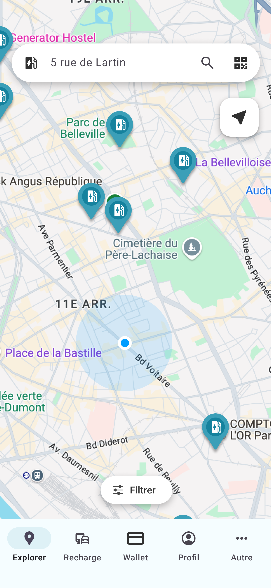
  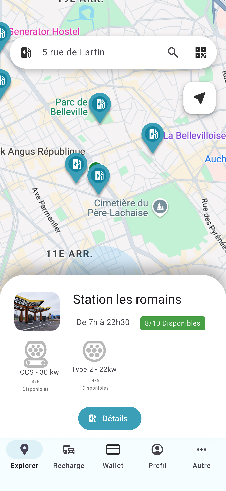
  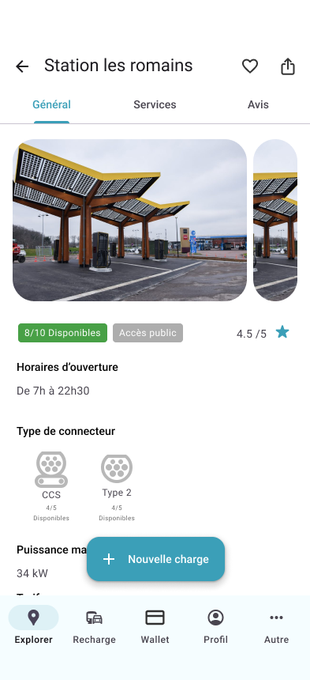
  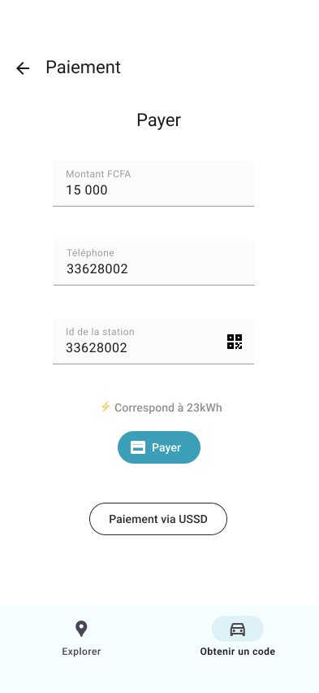
  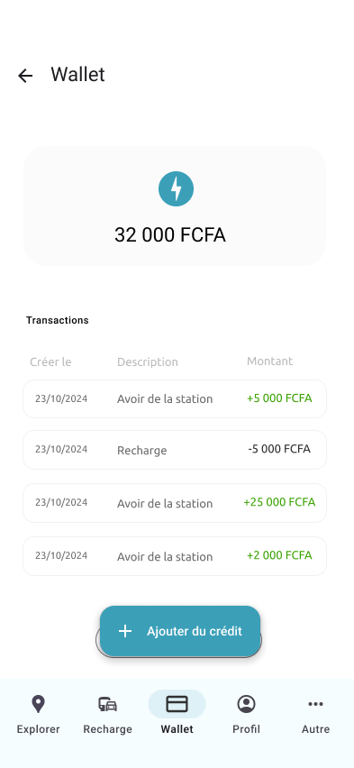
  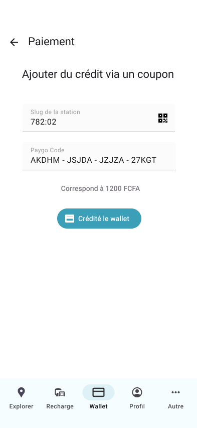
  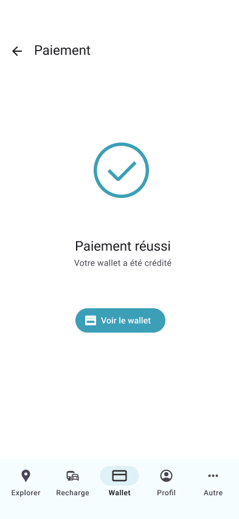
  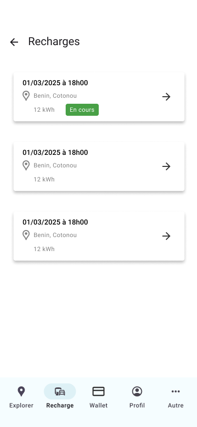
  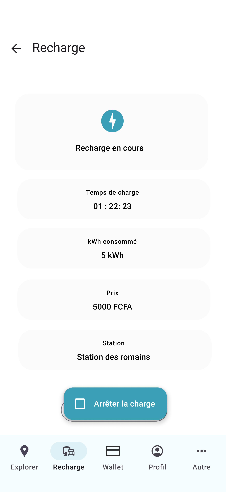
  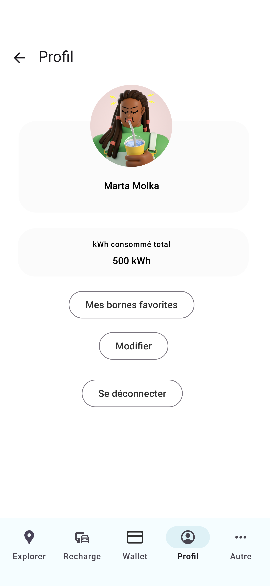
  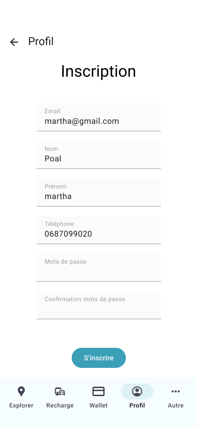
  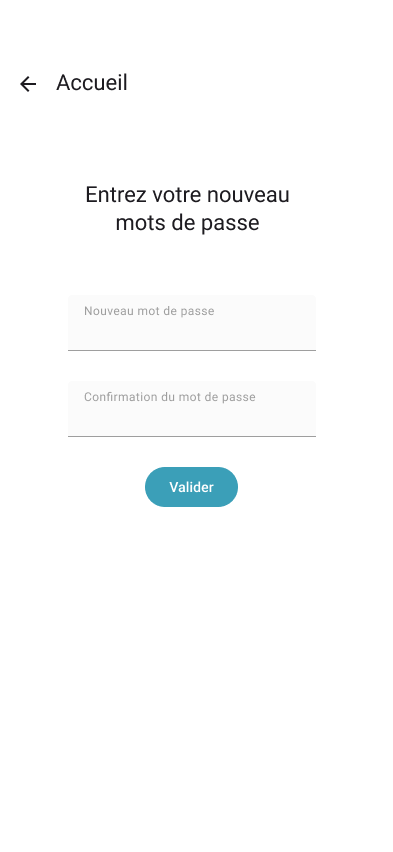
  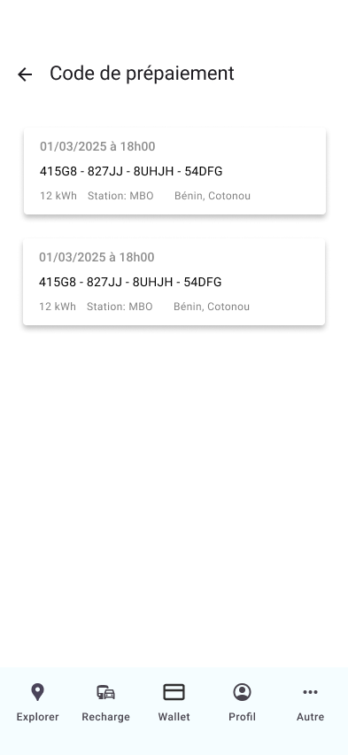
  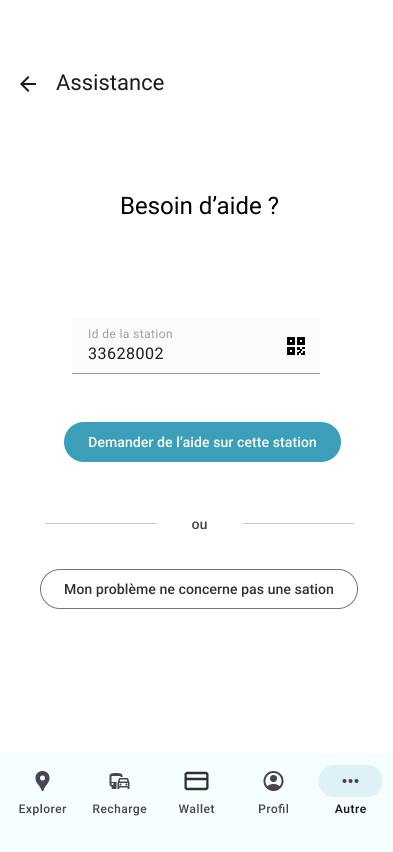

